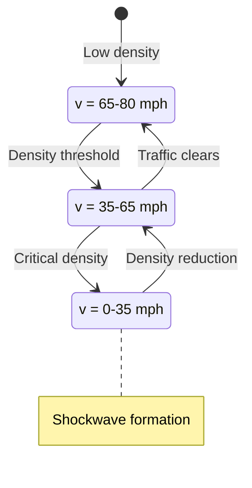

## Traffic Flow State Analysis

Traffic flow exhibits three distinct phases based on density-velocity relationships: free flow (v = vmax), synchronized flow (reduced velocity with increasing density), and congested flow (stop-and-go waves).



Fundamental relationship: q = k × v where q = flow (vehicles/hour), k = density (vehicles/mile), v = velocity (mph)


```python

```
