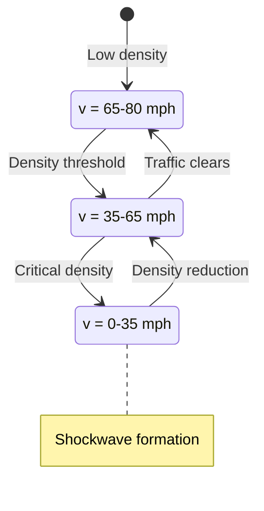
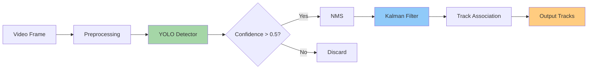
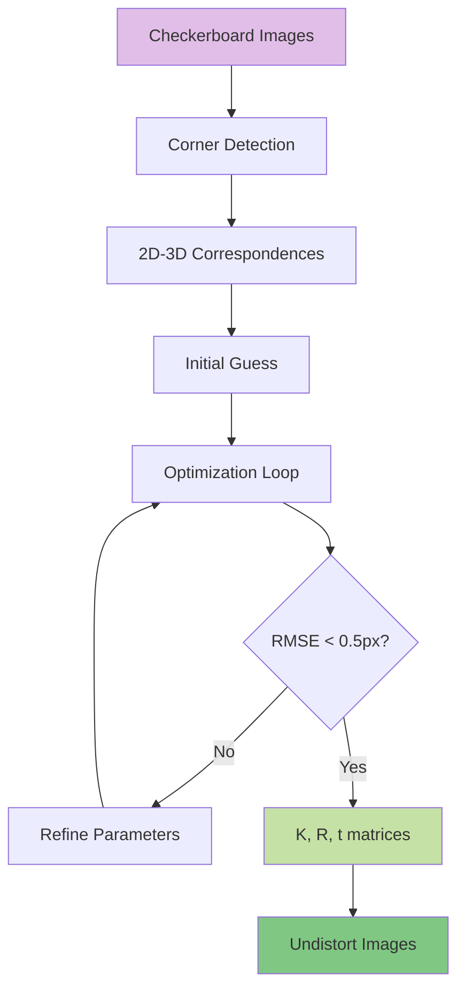

## Traffic Flow State Analysis

Traffic flow exhibits three distinct phases based on density-velocity relationships: free flow (v = vmax), synchronized flow (reduced velocity with increasing density), and congested flow (stop-and-go waves).



Fundamental relationship: q = k × v where q = flow (vehicles/hour), k = density (vehicles/mile), v = velocity (mph)

## Multi-Object Detection Pipeline

YOLO-based detection pipeline processes video frames at 30 FPS, achieving mAP@0.5 = 0.78 for vehicle detection across multiple classes.



Detection classes: Car (0.85), Truck (0.78), Bus (0.81), Motorcycle (0.72), Bicycle (0.69)

## Camera Calibration for Traffic Monitoring

Intrinsic and extrinsic calibration achieves reprojection error < 0.5 pixels using Zhang's method with checkerboard patterns.



Calibration matrix K contains: focal length (fx=1832.4, fy=1835.7), principal point (cx=956.2, cy=542.8)


```python

```
