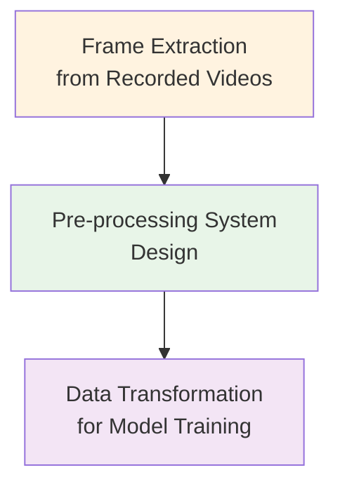
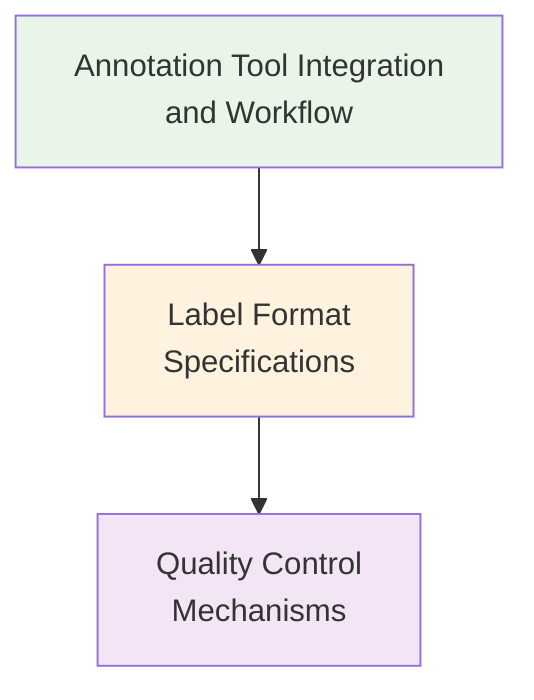
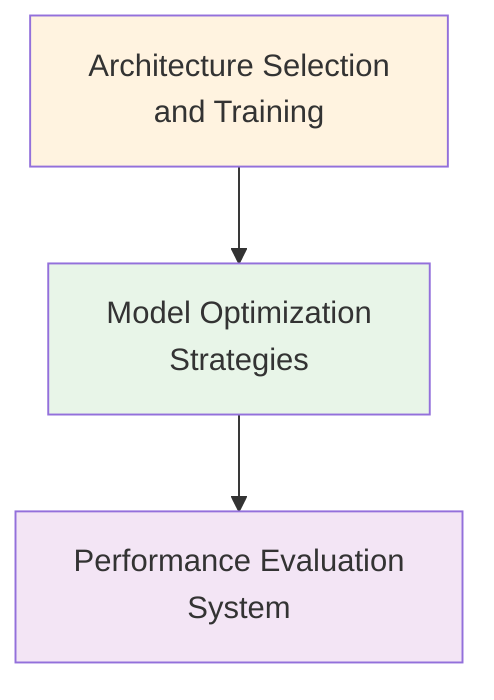
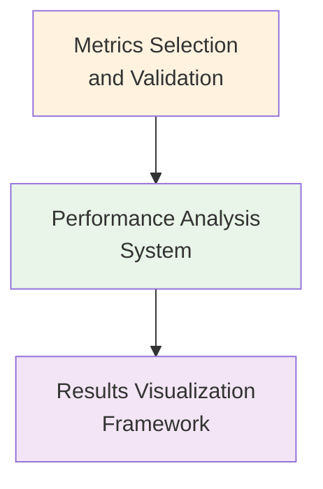
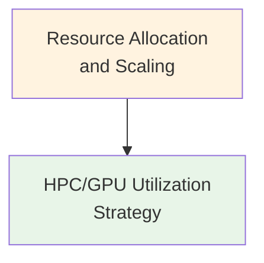
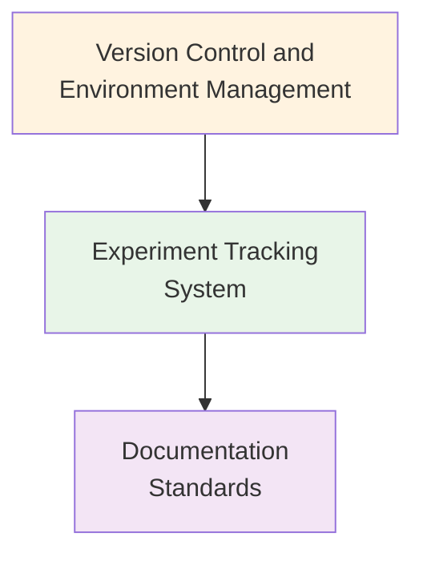

## Proposal Development Overview
> **Note:** This section is included for tracking notebook development progress and will be removed upon final version of the notebook.

| Section | Description | Key Components | Status | Version | Notes | Date | Author | Action Items |
|---------|-------------|----------------|:------:|:---------:|-------|------|--------|--------------|
| **1. Problem Statement and System Requirements** | Problem statement, requirements analysis, and system constraints | • Problem Statement<br>• Requirements Analysis<br>• System Constraints and Considerations<br>• System Overview | 🟢 | v0.0.1 | High-level technical scope aligned with README requirements<br>• Only includes explicitly stated components<br>• Avoids implementation specifics<br>• Traffic vision system architecture defined | 2025-06-11 | Chris Trauco | |
| **2. Data Management Subsystem** | Stream recording system, video storage and cataloging, data format standardization | • Architecture Considerations<br>• Design Considerations<br>• Implementation Approach | 🟢 | v0.0.1 | HPC scripts for capture and .mp4 conversion<br>• Video storage and cataloging systems<br>• Data format standardization<br>• Infrastructure component | 2025-06-11 | Chris Trauco | |
| **3. Data Preprocessing Framework** | Frame extraction, pre-processing system design, data transformation | • Architecture Considerations<br>• Design Considerations<br>• Implementation Approach | 🟢 | v0.0.1 | Frame extraction from recorded videos<br>• Pre-processing system design capabilities<br>• Data transformation for model training<br>• MLOps component | 2025-06-11 | Chris Trauco | |
| **4. Data Annotation Framework** | Annotation tool integration, label format specifications, quality control | • Architecture Considerations<br>• Design Considerations<br>• Implementation Approach | 🟢 | v0.0.1 | Annotation tool integration and workflow<br>• Label format specifications<br>• Quality control mechanisms<br>• MLOps component | 2025-06-11 | Chris Trauco | |
| **5. Model Development Framework** | Architecture selection, model optimization, performance evaluation | • Architecture Considerations<br>• Design Considerations<br>• Implementation Approach | 🟢 | v0.0.1 | Architecture selection and training<br>• Model optimization strategies<br>• Performance evaluation system<br>• MLOps component | 2025-06-11 | Chris Trauco | |
| **6. Evaluation Infrastructure** | Metrics selection, performance analysis, results visualization | • Architecture Considerations<br>• Design Considerations<br>• Implementation Approach | 🟢 | v0.0.1 | Metrics selection and validation<br>• Performance analysis system<br>• Results visualization framework<br>• MLOps component | 2025-06-11 | Chris Trauco | |
| **7. Computing Environment Architecture** | Resource allocation, HPC/GPU utilization strategy | • Architecture Considerations<br>• Design Considerations<br>• Implementation Approach | 🟢 | v0.0.1 | Resource allocation and scaling<br>• HPC/GPU utilization strategy<br>• Infrastructure component | 2025-06-11 | Chris Trauco | |
| **8. Reproducibility Framework** | Version control, experiment tracking, documentation standards | • Architecture Considerations<br>• Design Considerations<br>• Implementation Approach | 🟢 | v0.0.1 | Version control and environment management<br>• Experiment tracking system<br>• Documentation standards<br>• Infrastructure/MLOps component | 2025-06-11 | Chris Trauco | |

**Status Key:** 🔴 Not Started | 🟡 In Progress | 🟢 Complete

# Multi-Object Tracking Computer Vision System Design Proposal

## 1.1 Problem Statement

A transportation research team wants to analyze traffic camera footage to detect and track vehicles across multiple highway locations. They want to use computer vision models with optimization for deployment but struggle with handling video data from recorded live streams, model compression, and inference pipeline design and are unsure where to start. They need guidance on:
- Video data handling from recorded live streams
- Model compression  
- Inference pipeline design
- Computer vision model optimization for deployment

This represents a fundamental systems challenge requiring coordination of multiple computer vision components while maintaining scalability and reproducibility for traffic analysis.


## 1.2 Requirements Analysis

Based on the transportation research team's needs, the following requirements have been identified for the multi-object tracking computer vision system.

#### Data Management Requirements
- **Stream Recording System**: HPC scripts for capture and .mp4 conversion
- **Video Storage**: Video storage and cataloging systems
- **Data Format Standardization**: Standardized data formats across the system

#### Data Preprocessing Requirements
- **Frame Extraction**: Frame extraction from recorded videos
- **Pre-processing System**: Pre-processing system design capabilities
- **Data Transformation**: Data transformation for model training workflows

#### Data Annotation Requirements
- **Annotation Tool Integration**: Annotation tool integration and workflow management
- **Label Format Specifications**: Standardized label format specifications
- **Quality Control Mechanisms**: Quality control mechanisms for annotation accuracy

#### Model Development Requirements
- **Architecture Selection**: Architecture selection and training capabilities
- **Model Optimization**: Model optimization strategies for deployment
- **Performance Evaluation**: Performance evaluation system integration

#### Evaluation and Computing Requirements
- **Metrics Selection**: Metrics selection and validation frameworks
- **Performance Analysis**: Performance analysis system capabilities
- **Resource Allocation**: Resource allocation and scaling for HPC/GPU utilization

## 1.3 System Constraints and Considerations

#### Technical Constraints
- HPC Workstation: Must support GPU utilization 
- Video Data Storage: Traffic camera footage storage requirements
- Computer Vision Models: Models must support optimization for deployment
- Inference Pipeline: Pipeline design requirements

#### Performance Constraints
- Video Data Handling: System must handle video data from recorded streams
- Model Compression: Models require optimization for deployment

#### Design Considerations
- Video Processing: Methodical approach to streaming data and computational requirements
- Data System Design: Structured approach to annotation, preprocessing, and training workflows
- Model Optimization: Process-oriented approach to architecture selection and deployment
- System Evaluation: Comprehensive methodology for performance assessment and validation

#### Implementation Considerations
- Data Management Subsystem: Stream recording, video storage, and data format standardization
- Data Preprocessing Subsystem: Frame extraction, pre-processing system, and data transformation
- Data Annotation Framework: Annotation tool integration, label specifications, and quality control
- Model Development Framework: Architecture selection, optimization strategies, and performance evaluation
- Evaluation Infrastructure: Metrics selection, performance analysis, and results visualization
- Computing Environment Architecture: Resource allocation, HPC/GPU utilization strategy
- Reproducibility Framework: Version control, experiment tracking, and documentation standards

## 1.4 Multi-Object Tracking System Overview

This section provides an architectural overview of the proposed multi-object tracking computer vision system. The system separates infrastructure components from MLOps workflows to support scalable video processing and model development.

```mermaid
graph TD
   subgraph Infrastructure ["Infrastructure Components"]
       A[Data Management<br/>Subsystem]
       F[Computing Environment<br/>Architecture] 
       G[Reproducibility<br/>Framework]
   end
   
   subgraph MLOps ["MLOps Components"]
       B[Data Preprocessing<br/>Subsystem]
       C[Data Annotation<br/>Framework]
       D[Model Development<br/>Framework]
       E[Evaluation<br/>Infrastructure]
   end
   
   A --> B
   B --> C
   C --> D
   D --> E
   
   F -.-> A
   F -.-> B
   F -.-> C
   F -.-> D
   F -.-> E
   
   G -.-> A
   G -.-> B
   G -.-> C
   G -.-> D
   G -.-> E
   
   style Infrastructure fill:#e3f2fd
   style MLOps fill:#f3e5f5
   style A fill:#fff3e0
   style B fill:#e8f5e8
   style C fill:#fce4ec
   style D fill:#fff8e1
   style E fill:#f1f8e9
   style F fill:#e0f2f1
   style G fill:#fafafa

#### Summary

This section has identified the key requirements and constraints for developing a multi-object tracking computer vision system. The main challenges center around:

1. **Video Data Processing**: Handling video data from recorded streams and model compression
2. **Model Development**: Architecture selection, optimization strategies, and deployment
3. **System Integration**: Building a systematic approach for data management and evaluation

The subsequent sections will detail the technical architecture and implementation approach to address these requirements within the identified constraints.

## 2. Data Management Subsystem

### 2.1 Architecture Considerations

The data management subsystem for the multi-object tracking system addresses:

#### Stream Recording System
- **HPC Scripts**: Capture and .mp4 conversion

#### Video Storage and Cataloging
- **Storage System**: Video storage and cataloging

#### Data Format Standardization
- **Format Standards**: Data format standardization

### 2.2 Design Considerations

#### Stream Recording Design
- **HPC Script Architecture**: Capture and .mp4 conversion design
- **Recording Workflow**: Stream recording system implementation

#### Storage Design
- **Video Storage Framework**: Storage and cataloging architecture
- **Cataloging System**: Video organization and retrieval design

#### Format Standardization Design
- **Data Format Strategy**: Standardization approach for data formats
- **Format Specifications**: Data format standardization implementation

### 2.3 Implementation Approach

#### Stream Recording Implementation
- **HPC Script Deployment**: Configuration for capture and .mp4 conversion
- **Recording System Setup**: Stream recording system implementation

#### Storage Implementation
- **Video Storage Deployment**: Setup for video storage and cataloging
- **Cataloging Configuration**: Implementation of video organization system

#### Format Standardization Implementation
- **Data Format Setup**: Configuration of standardized data formats
- **Format Deployment**: Data format standardization implementation

```mermaid
graph TD
    A[Stream Recording System<br/>HPC Scripts] --> B[Video Storage<br/>and Cataloging]
    B --> C[Data Format<br/>Standardization]
    
    style A fill:#e1f5fe
    style B fill:#f3e5f5
    style C fill:#e8f5e8
```

#### Summary

This section has outlined the data management subsystem focusing on:
1. **Stream Recording System**: HPC scripts for capture and .mp4 conversion
2. **Video Storage and Cataloging**: Storage and cataloging systems
3. **Data Format Standardization**: Standardized data formats

These components ensure systematic video data handling for the multi-object tracking system. The next section will address the data preprocessing subsystem.

## 3. Data Preprocessing Subsystem

### 3.1 Architecture Considerations

The data preprocessing subsystem for the multi-object tracking system addresses:

#### Frame Extraction from Recorded Videos
- **Extraction Process**: Frame extraction from recorded videos

#### Pre-processing System Design
- **System Design**: Pre-processing system design

#### Data Transformation for Model Training
- **Transformation Methods**: Data transformation for model training

### 3.2 Design Considerations

#### Frame Extraction Design
- **Extraction Strategy**: Frame extraction methodology from recorded videos
- **Processing Framework**: Video frame processing architecture

#### Pre-processing Design
- **System Architecture**: Pre-processing system design approach
- **Processing Workflow**: Data processing pipeline design

#### Data Transformation Design
- **Transformation Pipeline**: Data transformation methodology for model training
- **Training Data Preparation**: Model training data formatting strategy

### 3.3 Implementation Approach

#### Frame Extraction Implementation
- **Extraction Setup**: Configuration for frame extraction from recorded videos
- **Processing Deployment**: Video frame processing implementation

#### Pre-processing Implementation
- **System Deployment**: Pre-processing system design implementation
- **Pipeline Configuration**: Processing workflow setup

#### Data Transformation Implementation
- **Transformation Setup**: Configuration of data transformation for model training
- **Training Data Pipeline**: Model training data preparation deployment



#### Summary

This section has outlined the data preprocessing subsystem focusing on:
1. **Frame Extraction**: Frame extraction from recorded videos
2. **Pre-processing System Design**: Pre-processing system design capabilities
3. **Data Transformation**: Data transformation for model training workflows

These components ensure systematic video data preprocessing for the multi-object tracking system. The next section will address the data annotation framework.

## 4. Data Annotation Framework

### 4.1 Architecture Considerations

The data annotation framework for the multi-object tracking system addresses:

#### Annotation Tool Integration and Workflow
- **Tool Integration**: Annotation tool integration and workflow

#### Label Format Specifications
- **Format Specifications**: Label format specifications

#### Quality Control Mechanisms
- **Quality Control**: Quality control mechanisms

### 4.2 Design Considerations

#### Annotation Tool Design
- **Integration Strategy**: Annotation tool integration methodology and workflow design
- **Workflow Framework**: Tool integration and processing architecture

#### Label Format Design
- **Specification Strategy**: Label format specification approach
- **Format Standards**: Standardized labeling methodology

#### Quality Control Design
- **Control Framework**: Quality control mechanism design
- **Validation Process**: Annotation quality assurance strategy

### 4.3 Implementation Approach

#### Annotation Tool Implementation
- **Integration Setup**: Configuration for annotation tool integration and workflow
- **Workflow Deployment**: Annotation tool and workflow implementation

#### Label Format Implementation
- **Specification Setup**: Configuration of label format specifications
- **Format Deployment**: Label format implementation

#### Quality Control Implementation
- **Control Setup**: Configuration of quality control mechanisms
- **Validation Deployment**: Quality control mechanism implementation



#### Summary

This section has outlined the data annotation framework focusing on:
1. **Annotation Tool Integration**: Annotation tool integration and workflow management
2. **Label Format Specifications**: Standardized label format specifications
3. **Quality Control Mechanisms**: Quality control mechanisms for annotation accuracy

These components ensure systematic data annotation for the multi-object tracking system. The next section will address the model development framework.

## 5. Model Development Framework

### 5.1 Architecture Considerations

The model development framework for the multi-object tracking system addresses:

#### Architecture Selection and Training
- **Architecture Selection**: Architecture selection and training

#### Model Optimization Strategies
- **Optimization Strategies**: Model optimization strategies

#### Performance Evaluation System
- **Evaluation System**: Performance evaluation system

### 5.2 Design Considerations

#### Architecture Selection Design
- **Selection Strategy**: Architecture selection methodology and training approach
- **Training Framework**: Model architecture and training design

#### Model Optimization Design
- **Optimization Framework**: Model optimization strategy approach
- **Strategy Implementation**: Optimization methodology design

#### Performance Evaluation Design
- **Evaluation Strategy**: Performance evaluation system methodology
- **Assessment Framework**: Model performance evaluation approach

### 5.3 Implementation Approach

#### Architecture Selection Implementation
- **Selection Setup**: Configuration for architecture selection and training
- **Training Deployment**: Architecture selection and training implementation

#### Model Optimization Implementation
- **Optimization Setup**: Configuration of model optimization strategies
- **Strategy Deployment**: Model optimization implementation

#### Performance Evaluation Implementation
- **Evaluation Setup**: Configuration of performance evaluation system
- **System Deployment**: Performance evaluation system implementation



#### Summary

This section has outlined the model development framework focusing on:
1. **Architecture Selection**: Architecture selection and training capabilities
2. **Model Optimization**: Model optimization strategies for deployment
3. **Performance Evaluation**: Performance evaluation system integration

These components ensure systematic model development for the multi-object tracking system. The next section will address the evaluation infrastructure.

## 6. Evaluation Infrastructure

### 6.1 Architecture Considerations

The evaluation infrastructure for the multi-object tracking system addresses:

#### Metrics Selection and Validation
- **Metrics Selection**: Metrics selection and validation

#### Performance Analysis System
- **Performance Analysis**: Performance analysis system

#### Results Visualization Framework
- **Results Visualization**: Results visualization framework

### 6.2 Design Considerations

#### Metrics Selection Design
- **Selection Strategy**: Metrics selection methodology and validation approach
- **Validation Framework**: Metrics validation and assessment design

#### Performance Analysis Design
- **Analysis Framework**: Performance analysis system methodology
- **System Architecture**: Performance evaluation and analysis approach

#### Results Visualization Design
- **Visualization Strategy**: Results visualization framework methodology
- **Framework Implementation**: Visualization system design approach

### 6.3 Implementation Approach

#### Metrics Selection Implementation
- **Selection Setup**: Configuration for metrics selection and validation
- **Validation Deployment**: Metrics selection and validation implementation

#### Performance Analysis Implementation
- **Analysis Setup**: Configuration of performance analysis system
- **System Deployment**: Performance analysis system implementation

#### Results Visualization Implementation
- **Visualization Setup**: Configuration of results visualization framework
- **Framework Deployment**: Results visualization framework implementation



#### Summary

This section has outlined the evaluation infrastructure focusing on:
1. **Metrics Selection**: Metrics selection and validation frameworks
2. **Performance Analysis**: Performance analysis system capabilities
3. **Results Visualization**: Results visualization framework

These components ensure systematic evaluation for the multi-object tracking system. The next section will address the computing environment architecture.

## 7. Computing Environment Architecture

### 7.1 Architecture Considerations

The computing environment architecture for the multi-object tracking system addresses:

#### Resource Allocation and Scaling
- **Resource Allocation**: Resource allocation and scaling

#### HPC/GPU Utilization Strategy
- **HPC/GPU Utilization**: HPC/GPU utilization strategy

### 7.2 Design Considerations

#### Resource Allocation Design
- **Allocation Strategy**: Resource allocation methodology and scaling approach
- **Scaling Framework**: System resource management and scaling design

#### HPC/GPU Utilization Design
- **Utilization Strategy**: HPC/GPU utilization methodology
- **Strategy Framework**: GPU and HPC resource optimization approach

### 7.3 Implementation Approach

#### Resource Allocation Implementation
- **Allocation Setup**: Configuration for resource allocation and scaling
- **Scaling Deployment**: Resource allocation and scaling implementation

#### HPC/GPU Utilization Implementation
- **Utilization Setup**: Configuration of HPC/GPU utilization strategy
- **Strategy Deployment**: HPC/GPU utilization strategy implementation



#### Summary

This section has outlined the computing environment architecture focusing on:
1. **Resource Allocation**: Resource allocation and scaling for HPC/GPU utilization
2. **HPC/GPU Utilization Strategy**: HPC/GPU utilization strategy

These components ensure systematic computing environment management for the multi-object tracking system. The next section will address the reproducibility framework.

## 8. Reproducibility Framework

### 8.1 Architecture Considerations

The reproducibility framework for the multi-object tracking system addresses:

#### Version Control and Environment Management
- **Version Control**: Version control and environment management

#### Experiment Tracking System
- **Experiment Tracking**: Experiment tracking system

#### Documentation Standards
- **Documentation Standards**: Documentation standards

### 8.2 Design Considerations

#### Version Control Design
- **Control Strategy**: Version control methodology and environment management approach
- **Management Framework**: Environment management and version control design

#### Experiment Tracking Design
- **Tracking Strategy**: Experiment tracking system methodology
- **System Framework**: Experiment management and tracking approach

#### Documentation Design
- **Standards Strategy**: Documentation standards methodology
- **Framework Implementation**: Documentation system design approach

### 8.3 Implementation Approach

#### Version Control Implementation
- **Control Setup**: Configuration for version control and environment management
- **Management Deployment**: Version control and environment management implementation

#### Experiment Tracking Implementation
- **Tracking Setup**: Configuration of experiment tracking system
- **System Deployment**: Experiment tracking system implementation

#### Documentation Implementation
- **Standards Setup**: Configuration of documentation standards
- **Framework Deployment**: Documentation standards implementation
- 



#### Summary

This section has outlined the reproducibility framework focusing on:
1. **Version Control**: Version control and environment management
2. **Experiment Tracking**: Experiment tracking system
3. **Documentation Standards**: Documentation standards

These components ensure systematic reproducibility for the multi-object tracking system.


