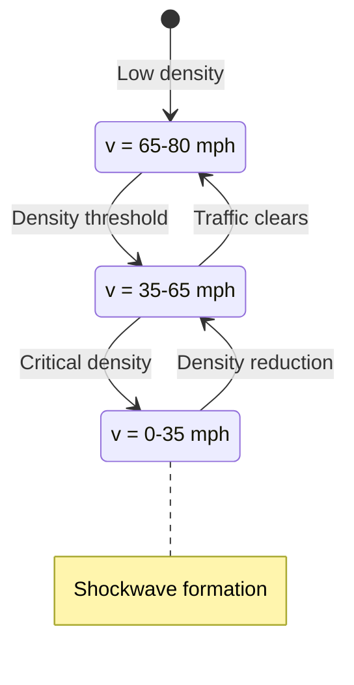
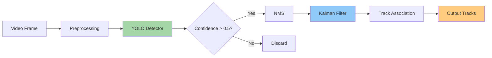
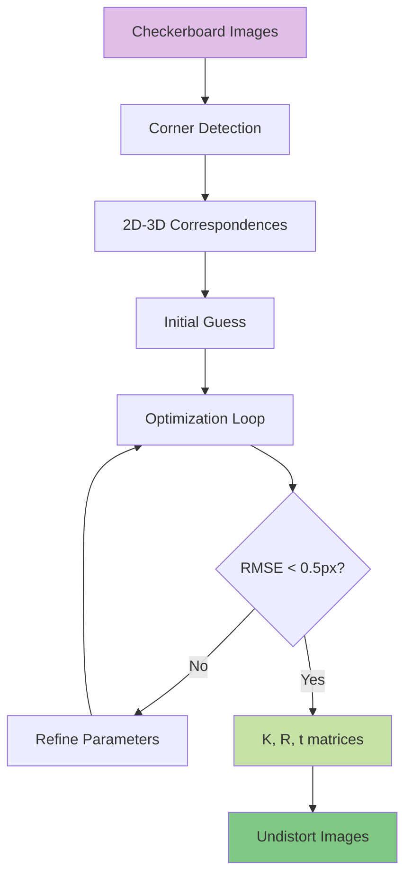
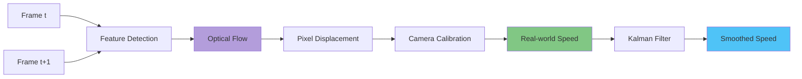
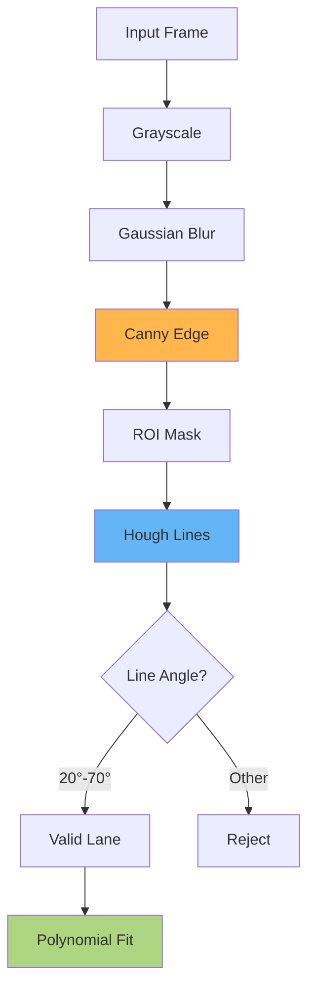
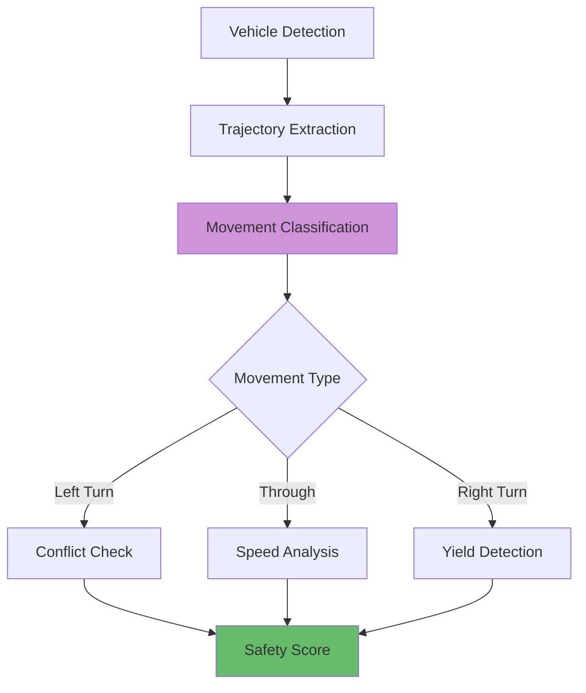

<!-- TOC -->
# Table of Contents

- [Traffic Flow State Analysis](#traffic-flow-state-analysis)
- [Multi-Object Detection Pipeline](#multi-object-detection-pipeline)
- [Camera Calibration for Traffic Monitoring](#camera-calibration-for-traffic-monitoring)
- [Vehicle Speed Estimation](#vehicle-speed-estimation)
- [Lane Detection Using Hough Transform](#lane-detection-using-hough-transform)
- [Intersection Movement Analysis](#intersection-movement-analysis)

<!-- /TOC -->


## Traffic Flow State Analysis

Traffic flow exhibits three distinct phases based on density-velocity relationships: free flow (v = vmax), synchronized flow (reduced velocity with increasing density), and congested flow (stop-and-go waves).



Fundamental relationship: q = k × v where q = flow (vehicles/hour), k = density (vehicles/mile), v = velocity (mph)

## Multi-Object Detection Pipeline

YOLO-based detection pipeline processes video frames at 30 FPS, achieving mAP@0.5 = 0.78 for vehicle detection across multiple classes.



Detection classes: Car (0.85), Truck (0.78), Bus (0.81), Motorcycle (0.72), Bicycle (0.69)

## Camera Calibration for Traffic Monitoring

Intrinsic and extrinsic calibration achieves reprojection error < 0.5 pixels using Zhang's method with checkerboard patterns.



Calibration matrix K contains: focal length (fx=1832.4, fy=1835.7), principal point (cx=956.2, cy=542.8)

## Vehicle Speed Estimation

Optical flow-based speed estimation using Lucas-Kanade method achieves ±3 mph accuracy when calibrated with ground truth radar data.



Speed = (pixel_displacement × scale_factor) / time_delta, where scale_factor = 0.142 m/pixel at 50m distance

## Lane Detection Using Hough Transform

Edge detection and probabilistic Hough transform identify lane markings with 94% accuracy under daylight conditions.



Parameters: Canny(50,150), Hough(ρ=1, θ=π/180, threshold=50, minLength=100, maxGap=50)

## Intersection Movement Analysis

Computer vision tracks turning movements at 4-way intersection, detecting conflicts with 89% precision using trajectory prediction.



Hourly movements: Left=312, Through=847, Right=423. Critical conflicts: 17/hour (2.1% of turns)


```python

```
